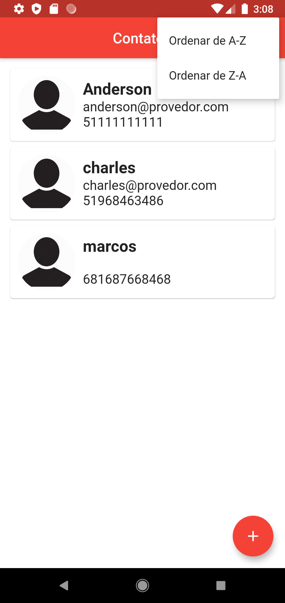
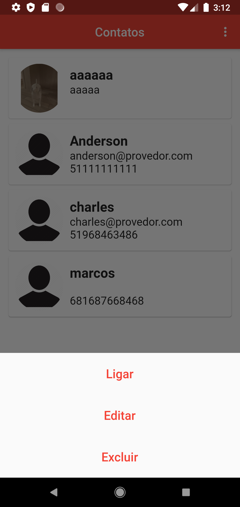

# Contact list

Olá, este é um projeto em flutter de uma lista de contatos.

Este projeto foi realizado para criar uma lista de contatos pessoais. Foi utilizado o [sqflite](https://pub.dev/packages/sqflite) para criar um banco de dados, para armazenar os contatos e utilizamos o [image_picker](https://pub.dev/packages/image_picker) para auxiliar para o usuário tirar uma foto e colocar em algum contato.

  

## Screenshots
<table>

<tr>
	<td></td>
	<td></td>
</tr>

<tr>
	<td></td>
	<td></td>
</tr>

</table>
